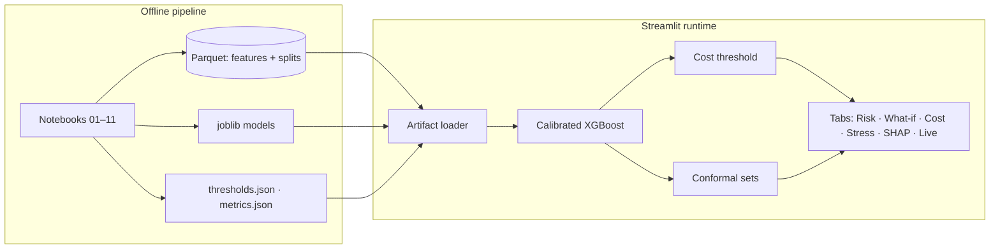
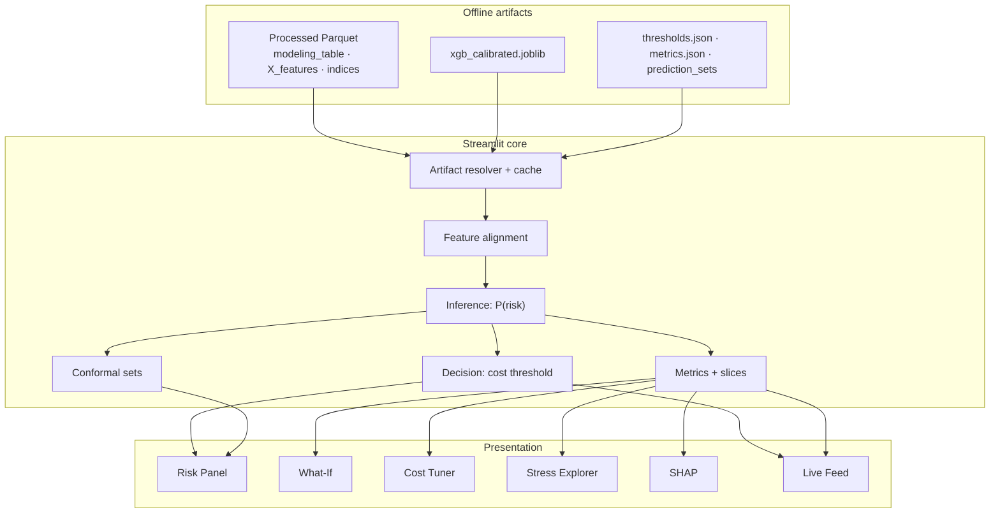
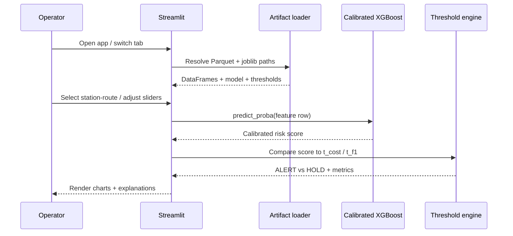
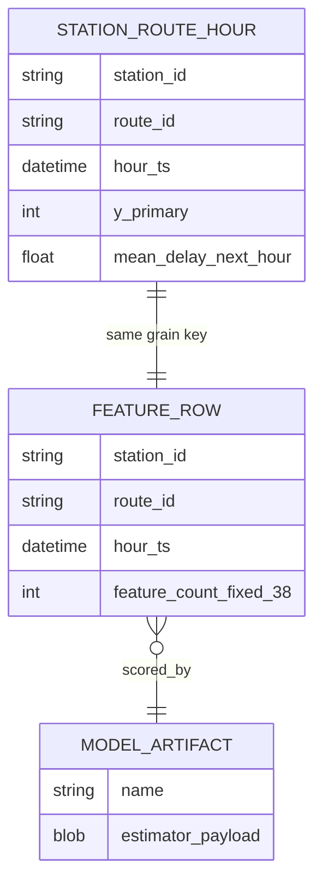
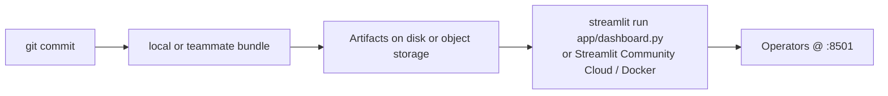
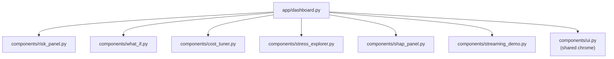

<p align="center">
  
</p>

<h1 align="center"> TransitRisk</h1>

<p align="center">
  <strong>Know delays before they cascade — calibrated, cost-sensitive next-hour risk for every station–route pair.</strong>
</p>

<p align="center">
  <em>Hi — I’m <strong>Manav</strong>. I built this for my <strong>DATA 245</strong> (Spring 2026) project: a system I’d actually want on a dispatch desk, not just a notebook that never leaves Jupyter.</em>
</p>

<p align="center">
  <a href="https://www.python.org/downloads/"></a>
  <a href="https://streamlit.io/"></a>
  <a href="https://github.com/patel-manav20/TransitRisk-Machine-Learning-Project"></a>
  <a href="https://github.com/patel-manav20/TransitRisk-Machine-Learning-Project/network/members"></a>
  
  
  
</p>

<p align="center">
  <!-- TODO: Add a screen recording → save as <code>./assets/hero-demo.gif</code> and swap the src below -->
  
</p>
<p align="center"><em>I’ll drop a real screen recording at <code>./assets/hero-demo.gif</code> when I have a polished take ✨</em></p>

---

## Table of contents

- [The hook](#-the-hook-why-this-exists)
- [Key features](#-key-features)
- [Architecture](#-architecture--how-i-built-it)
- [Tech stack](#-tech-stack)
- [Quick start](#-quick-start-get-running-in-60-seconds)
- [Project structure](#-project-structure)
- [Usage & examples](#-usage--examples)
- [Configuration](#-configuration--environment-variables)
- [Diagrams](#-diagrams-mermaid-reference)
- [Screenshots](#-screenshots--visuals)
- [Testing](#-testing)
- [Deployment](#-deployment)
- [Roadmap](#-roadmap)
- [Contributing](#-contributing)
- [License](#-license)
- [Acknowledgments](#-acknowledgments--credits)

---

## 🎯 The hook (why this exists)

I’ve lost count of how many times I’ve seen ops teams stuck in spreadsheets while delays already happened — **if only** someone had flagged risk in plain language an hour earlier.

**TransitRisk** is my answer to that. I take station–route–hour history (weather, headways, lags — **38 features** total) and turn it into a **calibrated probability** that the *next hour* will be “elevated” delay-wise. I then apply a **cost-optimal alert threshold** (I treat missing a real delay as **5×** worse than a false alarm in the default setup) and wrap the whole thing in a **Streamlit dashboard** so you can *see* the risk, play what-if, and argue about policy with numbers instead of vibes.

---

## ✨ Key features

Here’s what I focused on — each line is something I actually use when I demo the app:

- 🎯 **Next-hour risk, not a fuzzy on-time %** — I framed the problem as binary *elevated vs normal* because that’s the decision dispatch actually makes.
- 📊 **Calibrated XGBoost** — I compared **seven** models; XGBoost won. I calibrated it so the probabilities mean something at decision time — held-out **ROC-AUC ~0.81**, **PR-AUC ~0.77**, **Brier ~0.169**.
- 💸 **Cost-sensitive alerts** — I built a **Cost Tuner** tab so you can feel how FN vs FP costs move the optimal threshold; my default cost-optimal cutoff is **t ≈ 0.163**.
- 🧪 **Conformal uncertainty** — I added split conformal prediction sets — **~92% coverage** at α = 0.1 on my evaluation setup.
- 🌡 **Stress-aware evaluation** — I slice metrics by weather, peaks, demand, and headways because a model that only works on “nice” days isn’t useful.
- 🔍 **SHAP + what-if** — I wanted to explain *one row at a time* and drag sliders without re-running the whole pipeline.
- 🔴 **Live feed simulator** — I replay the test set like a stream so you can watch **ALERT / HOLD** decisions accumulate — closer to how I imagine real monitoring.

---

## 🏗 Architecture / how I built it

I split the work into two halves on purpose:

1. **Offline** — I use notebooks (wired up with a `Makefile`) to generate data, engineer features, train models, calibrate, and export Parquet + `joblib` artifacts.  
2. **Online** — The Streamlit app **only loads** those files. I didn’t want the dashboard secretly retraining or drifting from what I evaluated.



**How I’d explain it to a friend:** I run the notebooks (or `make all` when I’m regenerating everything) to build the modeling table, fit the models, calibrate XGBoost, and save thresholds + conformal outputs. When you open the app, it finds those artifacts in the repo, in a sibling `transitrisk_data_models/` folder, or wherever you point `TRANSITRISK_ARTIFACTS_DIR`, then caches them and drives all six tabs from the **same** loaded model and test indices.

---

## 🧰 Tech stack

What I actually used day-to-day:

| Layer | Technology | Why I picked it |
|--------|------------|-----------------|
| **UI** | [Streamlit](https://streamlit.io/) | Fastest path from model → interactive dashboard without spinning up a separate frontend. |
| **ML** | [XGBoost](https://xgboost.readthedocs.io/), [scikit-learn](https://scikit-learn.org/) | Strong tabular baseline + calibration + metrics all in one ecosystem. |
| **Explainability** | [SHAP](https://github.com/shap/shap) | I needed “why this hour?” answers for the report and the demo. |
| **Data** | [pandas](https://pandas.pydata.org/), [PyArrow](https://arrow.apache.org/docs/python/) / [fastparquet](https://fastparquet.readthedocs.io/) | Parquet kept my feature matrices sane on disk. |
| **Viz** | [Plotly](https://plotly.com/python/), [Matplotlib](https://matplotlib.org/), [Seaborn](https://seaborn.pydata.org/) | Plotly in the app; the others for paper-style figures. |
| **Orchestration** | [Jupyter](https://jupyter.org/), `make` | Notebooks for narrative + `make` so I don’t forget the run order. |
| **Serialization** | [joblib](https://joblib.readthedocs.io/) | Simple `dump`/`load` for sklearn pipelines and the boosted model. |
| **Tests** | [pytest](https://pytest.org/) *(install separately — see [Testing](#-testing))* | I guard leakage and conformal behavior so refactors don’t break the story. |

<p align="center">
  
  
  
  
</p>

---

## ⚡ Quick start (get running in ~60 seconds)

If you just want the dashboard, this is the path I use — **no training required** as long as the saved `data/` and `models/` are in place.

**Prerequisites**

- **Python 3.10+** (I’ve been on **3.12** — details in `RUN_LOCAL.md`)
- `pip` + a venv (I don’t recommend installing into system Python)
- **Artifacts**: `data/processed/*.parquet`, `train_val_test_indices.json`, and `models/xgb_calibrated.joblib` — from this repo, a zip someone shared with you, or a sibling bundle (below)

**Steps**

1. **Clone this repo** (or unzip a copy) and `cd` into the project root (the folder that contains `app/` and `requirements.txt`).

```bash
git clone https://github.com/patel-manav20/TransitRisk-Machine-Learning-Project.git
cd TransitRisk-Machine-Learning-Project
```

2. **Create a venv and install dependencies**

```bash
python3 -m venv .venv
source .venv/bin/activate   # Windows: .venv\Scripts\activate
pip install --upgrade pip
pip install -r requirements.txt
```

3. **(If needed) Drop in data + models** — I often keep a fat zip or a sibling folder `transitrisk_data_models/` next to the code so Git stays light. You can also `export TRANSITRISK_ARTIFACTS_DIR=...` (see [Configuration](#-configuration--environment-variables)).

4. **Launch the dashboard**

```bash
streamlit run app/dashboard.py
```

**You should see:** Streamlit prints a local URL and opens the app — **✅ `http://localhost:8501`** (default).

5. **Sanity check** — Open the sidebar tab guide, hit **📡 Risk Panel** — you should see my gauges and charts. If you get my “artifacts missing” message, the paths in step 3 aren’t right yet.

**Regenerating everything from scratch** (what I run when I want a clean end-to-end pass, ~60–90 min):

```bash
make all          # data → clean → features → train → calibrate → figures (executes notebooks)
make dashboard    # same as: streamlit run app/dashboard.py
```

---

## 📦 Project structure

```text
📦 transitrisk/
├── 📂 app/
│   ├── 📄 dashboard.py           # Streamlit entry — layout, theming, artifact loading
│   └── 📂 components/            # One module per tab (risk, what-if, SHAP, …)
├── 📂 src/                       # Importable ML library (data_gen → evaluation)
│   ├── 📄 data_gen.py
│   ├── 📄 cleaning.py
│   ├── 📄 targets.py
│   ├── 📄 features.py
│   ├── 📄 splits.py
│   ├── 📄 models.py
│   ├── 📄 calibration.py
│   ├── 📄 conformal.py
│   ├── 📄 cost.py
│   ├── 📄 evaluation.py
│   └── 📄 plots.py
├── 📂 notebooks/                 # 01_data_generation … 11_final_results_and_figures
├── 📂 data/
│   ├── 📂 raw/                   # Synthetic or ingested events
│   └── 📂 processed/           # Feature matrix, splits, optional prediction_sets
├── 📂 models/                    # *.joblib (baselines + xgb_calibrated, etc.)
├── 📂 figures/                   # metrics.json + exported plots
├── 📂 tests/                     # pytest — leakage, features, conformal, targets
├── 📂 notes/                     # Design & audit markdown
├── 📂 report/                    # IEEE-style LaTeX + diagram sources
├── 📄 Makefile                   # make data | models | eval | dashboard | tests
├── 📄 requirements.txt
├── 📄 RUN_LOCAL.md               # Artifact layout & troubleshooting
├── 📄 PROJECT_CONTEXT.md         # Deep context for collaborators
└── 📄 README.md                  # You are here ✨
```

---

## 🧭 Usage & examples

I didn’t ship a REST API — **the dashboard is the product**, and the `Makefile` is how I reproduce training without clicking cells in order for an hour.

<details>
<summary><strong>📡 Dashboard workflows (click to expand)</strong></summary>

| Tab | What you do | What you get |
|-----|-------------|----------------|
| **📡 Risk Panel** | Pick station → route | Next-hour risk gauge, route comparison, conformal context when artifacts exist |
| **🔧 What-If** | Drag weather / demand sliders | Counterfactual risk vs baseline |
| **💰 Cost Tuner** | Adjust FN:FP cost ratio | Live optimal threshold + confusion dynamics |
| **🌡 Stress Explorer** | Slice test rows | Robustness under stress regimes |
| **🔍 SHAP** | Choose a test row | Feature attributions for that prediction |
| **🔴 Live Feed** | Step through stream | ALERT/HOLD narrative + running metrics |

</details>

<details>
<summary><strong>🛠 Makefile cheat sheet</strong></summary>

```bash
make help         # Describe all targets
make install      # pip install -r requirements.txt
make data         # Notebook 01 — synthetic events (skips if raw exists)
make clean_data   # Notebook 02
make features     # Notebook 04 — 38 features
make models       # Notebooks 05–06 — seven models
make eval         # Notebooks 07–11 — calibration, conformal, stress, figures
make all          # Full pipeline
make tests        # pytest (requires pytest installed)
make dashboard    # Streamlit
```

</details>

**Snippet I use in notebooks** (same loads as the app — handy for one-off checks):

```python
# Reproduce a single P(risk) without opening Streamlit
from pathlib import Path
import json
import joblib
import pandas as pd

root = Path(".")
X = pd.read_parquet(root / "data/processed/X_features.parquet")
with open(root / "data/processed/train_val_test_indices.json") as f:
    idx = json.load(f)
test_rows = X.iloc[idx["test"]]
model = joblib.load(root / "models/xgb_calibrated.joblib")
proba = model.predict_proba(test_rows.iloc[[0]])[:, 1][0]
print(f"P(elevated delay next hour) ≈ {proba:.3f}")
```

---

## 🔧 Configuration & environment variables

I haven’t committed a `.env.example` yet — **TODO on my side:** add one at the repo root. Until then, here’s the only env var I rely on for layout flexibility:

| Variable | Required | Default | Description |
|----------|----------|---------|-------------|
| `TRANSITRISK_ARTIFACTS_DIR` | No | *(unset)* | I check this first when I want the code in one folder and the heavy Parquet/joblib bundle somewhere else. It should contain `data/`, `models/`, and optionally `figures/`. |

For Streamlit flags (`--server.port`, `--server.headless true`, etc.) I documented what works on my machine in [RUN_LOCAL.md](./RUN_LOCAL.md).

---

## 📐 Diagrams (Mermaid reference)

### System architecture



### Request / interaction flow



### Conceptual data layout (ER-style)



### Deployment / release flow (today)



### Streamlit component tree



---

## 🖼 Screenshots & visuals

<p align="center">
  
</p>
<p align="center"><em>What I’m aiming to show: Dashboard ✨</em></p>

---

## 🧪 Testing

```bash
pip install pytest pytest-cov   # I still need to pin these in a requirements-dev.txt — on my list
pytest tests/ -v
```

**Coverage (when I want a guilt trip about untested lines):**

```bash
pytest tests/ --cov=src --cov-report=term-missing
```

<p align="center">
  
  
</p>

**Why I bothered:** I wrote these tests so I can’t accidentally **leak the future** into features, break **lag math**, mis-build **y_primary**, or silently violate **conformal coverage** while I’m “just tweaking” a notebook.

---

## 🚀 Deployment

I haven’t committed a **Dockerfile** or **GitHub Actions** yet — what’s below is what I’d do next.

### Streamlit Community Cloud (what I’d try first)

1. Push to GitHub with a plan for **artifacts** (the free tier won’t love running `make all` if the bundle is huge — I’d look at [Git LFS](https://git-lfs.github.com/) or a small download-on-start script).  
2. Point [share.streamlit.io](https://share.streamlit.io/) at **`app/dashboard.py`**.  
3. Mirror any secrets I need as Streamlit **Secrets** (e.g. paths / `TRANSITRISK_ARTIFACTS_DIR` if I mount storage).

<!-- TODO: Replace href with your deployed URL -->
<p align="center">
  <a href="https://share.streamlit.io/"></a>
</p>

### Docker (sketch — I haven’t battle-tested this in CI yet)

```dockerfile
# TODO: I’ll commit a real Dockerfile once I trim image size
FROM python:3.12-slim
WORKDIR /app
COPY requirements.txt .
RUN pip install --no-cache-dir -r requirements.txt
COPY . .
ENV STREAMLIT_SERVER_HEADLESS=true
EXPOSE 8501
CMD ["streamlit", "run", "app/dashboard.py", "--server.address", "0.0.0.0"]
```

```bash
docker build -t transitrisk .
docker run -p 8501:8501 -e TRANSITRISK_ARTIFACTS_DIR=/data -v /path/to/bundle:/data transitrisk
```

---

## 🗺 Roadmap

### Now

- [x] End-to-end notebook pipeline + `Makefile` targets  
- [x] Calibrated XGBoost + cost + conformal exports  
- [x] Streamlit dashboard (six tabs)  
- [x] Core pytest guards (15 tests)

### Next (my honest backlog)

- [ ] Add a **`LICENSE`** (once I align with course policy / collaborators) and fix the gray badge  
- [ ] Add **`.env.example`** + **`requirements-dev.txt`** so `pytest` isn’t a mystery step  
- [ ] **GitHub Actions** for lint + tests on PRs  
- [ ] A real **Dockerfile** I’ve actually run in production-ish conditions  
- [ ] Stretch: pipe in **real GTFS / AVL** (right now I’m on synthetic data + a strict Parquet contract)

---

## 🤝 Contributing

If you fork this and fix something, I’d genuinely appreciate it.

- **Bugs** — Open an issue with repro steps, your Python version, and whether you built artifacts with `make all` or dropped in a zip.  
- **Ideas** — Tell me the *operator story* — what decision should get easier?  
- **PRs** — Small, focused diffs are easier for me to review.

I still owe everyone a proper [`CONTRIBUTING.md`](./CONTRIBUTING.md) — branch names, review expectations, the usual.

**Good first issues if you want to help:** doc fixes, `requirements-dev.txt`, a **Dockerfile**, extra tests around `src/features.py`, or a **light/dark toggle** in Streamlit.

---

## 📄 License

I haven’t dropped a `LICENSE` file in the repo yet — I need to align with course / collaborators and then I’ll update this README.

Plain English for now: **assume all rights reserved** until I publish a license; ping me if you need to redistribute or commercialize.

---

## 🙏 Acknowledgments & credits

- **XGBoost + scikit-learn** — saved me weeks I didn’t have.  
- **SHAP** — when the professor asks “why,” I have an answer.  
- **Streamlit** — let me ship a UI without becoming a frontend engineer.  
- **SJSU DATA 245 · Spring 2026** — the class that forced me to turn this into something end-to-end. If you want every design decision in long form, I wrote it up in `PROJECT_CONTEXT.md`.

---

<p align="center">
  <strong>Built with ❤️ by Manav Patel · SJSU DATA 245 (Spring 2026)</strong>
</p>

<p align="center">
  <em>Repo: <a href="https://github.com/patel-manav20/TransitRisk-Machine-Learning-Project">patel-manav20/TransitRisk-Machine-Learning-Project</a> — update X / LinkedIn below to your profiles.</em>
</p>

<p align="center">
  <a href="https://github.com/patel-manav20/TransitRisk-Machine-Learning-Project"></a>
  &nbsp;
  <a href="https://twitter.com/"></a>
  &nbsp;
  <a href="https://www.linkedin.com/"></a>
</p>

<p align="center">
  <a href="https://star-history.com/#patel-manav20/TransitRisk-Machine-Learning-Project&amp;Date">
    
  </a>
</p>
