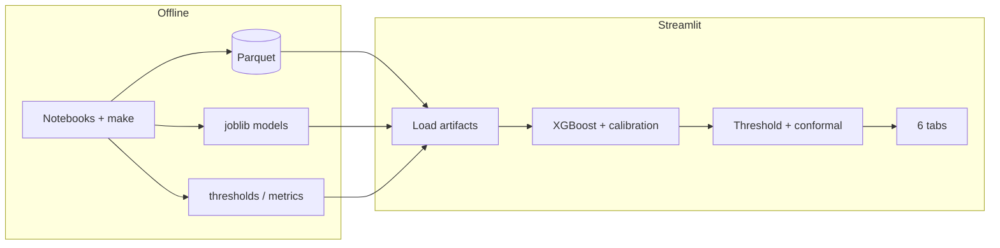
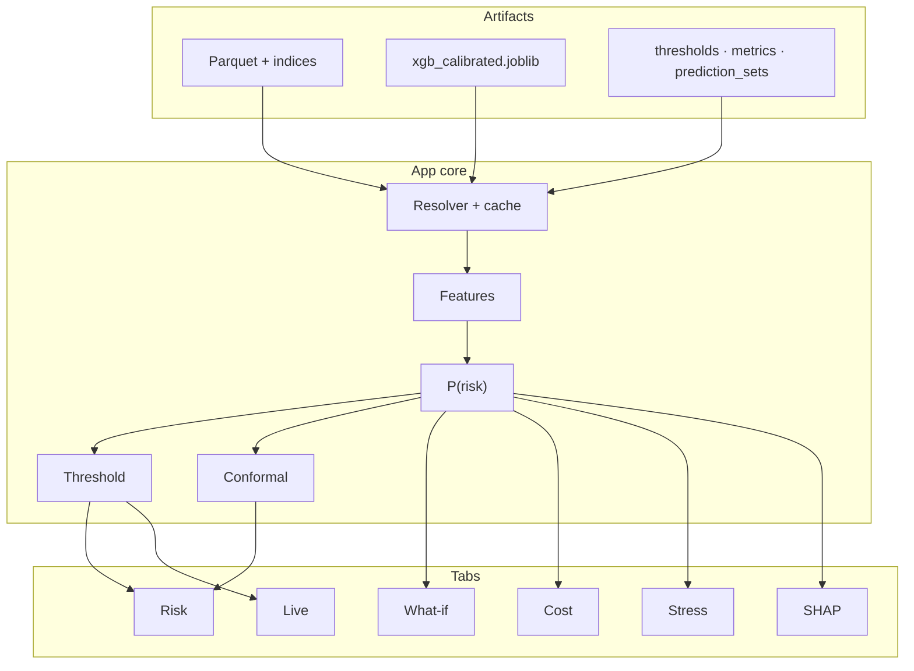
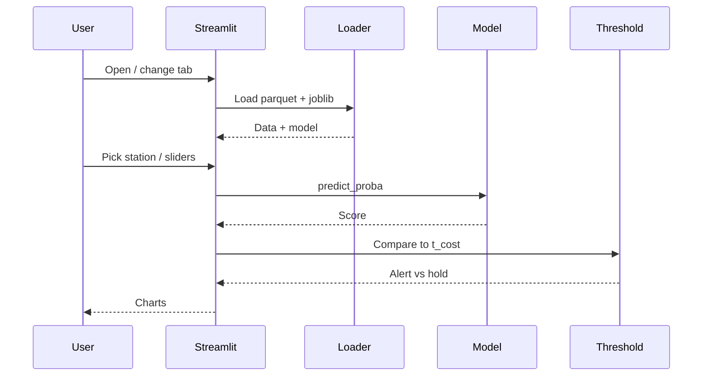
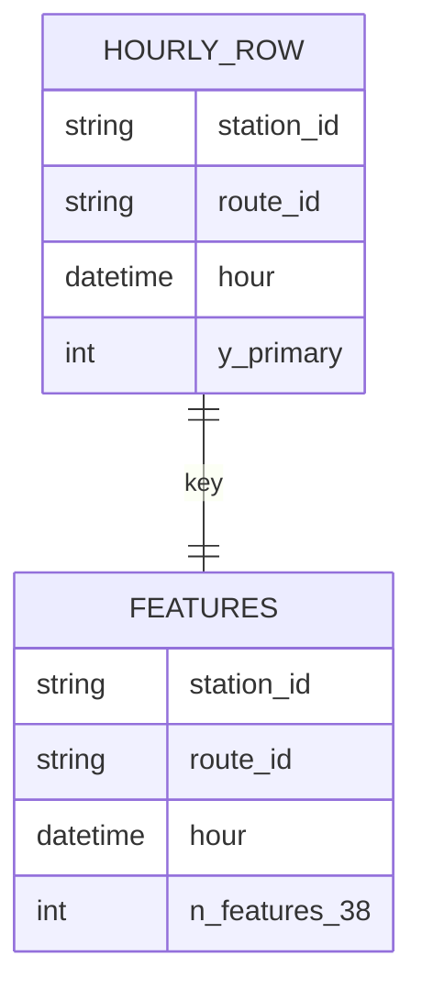
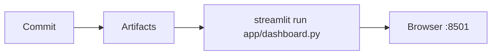
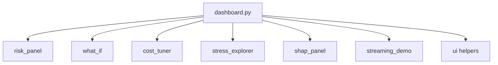

<p align="center">
  
</p>

<h1 align="center"> TransitRisk</h1>

<p align="center"><strong>Next-hour delay risk for every station–route pair — calibrated, cost-aware, built for a dispatch-style dashboard.</strong></p>

<p align="center"><sub>DATA 245 · Spring 2026 · Manav Patel</sub></p>

<p align="center">
  <a href="https://www.python.org/"></a>
  <a href="https://streamlit.io/"></a>
  <a href="https://github.com/patel-manav20/TransitRisk-Machine-Learning-Project"></a>
</p>

---

## Dashboard

<p align="center">
  
</p>
<p align="center"><em>Live dashboard preview</em></p>

---

## Contents

[What & why](#what--why) · [Features](#features) · [Architecture](#architecture) · [Tech stack](#tech-stack) · [Quick start](#quick-start) · [Structure](#project-structure) · [Usage](#usage) · [Environment](#environment) · [Diagrams](#diagrams) · [Testing](#testing) · [Deploy](#deploy)

---

## What & why

I built TransitRisk for **DATA 245**: predict, **one hour ahead**, whether a station–route will hit **elevated** delay (binary target; **38** features including lags, weather, headways). Raw delay regression was too noisy; this framing reaches about **0.81** ROC-AUC on held-out data. The app is **Streamlit**: it **loads** saved Parquet + `joblib` only — no surprise retraining in the UI.

---

## Features

- **Calibrated XGBoost** (chosen from 7 models) + **cost-optimal** threshold (default **t ≈ 0.163**, FN weighted **5×** FP in my setup)
- **Conformal** prediction sets (~**92%** coverage at α = 0.1 in my eval)
- **Six tabs:** Risk panel, What-if, Cost tuner, Stress explorer, SHAP, Live feed replay
- **Notebooks 01–11** + **`Makefile`** for the full offline pipeline

---

## Architecture

Offline notebooks produce artifacts; the dashboard only consumes them.



---

## Tech stack

| Layer | Stack |
|--------|--------|
| UI | Streamlit |
| ML | XGBoost, scikit-learn, imbalanced-learn |
| Explainability | SHAP |
| Data | pandas, PyArrow / fastparquet |
| Viz | Plotly, Matplotlib, Seaborn |
| Orchestration | Jupyter, GNU make |
| Tests | pytest *(install separately)* |

---

## Quick start

```bash
git clone https://github.com/patel-manav20/TransitRisk-Machine-Learning-Project.git
cd TransitRisk-Machine-Learning-Project

python3 -m venv .venv && source .venv/bin/activate   # Windows: .venv\Scripts\activate
pip install -r requirements.txt

streamlit run app/dashboard.py
```

→ **http://localhost:8501** · Need `data/processed/*`, `train_val_test_indices.json`, and `models/xgb_calibrated.joblib` (or set `TRANSITRISK_ARTIFACTS_DIR`). See **`RUN_LOCAL.md`**.

Full regeneration:

```bash
make all && make dashboard
```

---

## Project structure

```
transitrisk/
├── app/                 # dashboard.py + components/ (one file per tab)
├── src/                 # data_gen, features, models, calibration, conformal, …
├── notebooks/           # 01 … 11
├── data/raw|processed/
├── models/              # *.joblib
├── figures/
├── tests/
├── Makefile
├── requirements.txt
└── RUN_LOCAL.md
```

---

## Usage

**Tabs**

| Tab | Purpose |
|-----|---------|
| Risk panel | Station → route, next-hour risk gauge |
| What-if | Sliders on weather / demand |
| Cost tuner | FN:FP ratio → threshold + confusion view |
| Stress explorer | Slices by weather, peak, demand, headway |
| SHAP | Row-level attributions |
| Live feed | Replay test rows as a stream |

**Make targets**

```bash
make help          # all targets
make data          # notebook 01 (skips if raw exists)
make clean_data    # 02
make features      # 04
make models        # 05–06
make eval          # 07–11
make all
make tests         # needs: pip install pytest
make dashboard
```

**One-off score in Python**

```python
from pathlib import Path
import json, joblib, pandas as pd

root = Path(".")
X = pd.read_parquet(root / "data/processed/X_features.parquet")
with open(root / "data/processed/train_val_test_indices.json") as f:
    idx = json.load(f)
model = joblib.load(root / "models/xgb_calibrated.joblib")
row = X.iloc[idx["test"]].iloc[[0]]
print(model.predict_proba(row)[:, 1][0])
```

---

## Environment

| Variable | Required | Description |
|----------|----------|-------------|
| `TRANSITRISK_ARTIFACTS_DIR` | No | Folder containing `data/`, `models/` (optional `figures/`) if not beside the repo |

---

## Diagrams

### System overview



### Request flow



### Data grain (conceptual)



### Ship path



### UI components



---

## Testing

```bash
pip install pytest
pytest tests/ -v
```

Covers temporal leakage guards, feature lags, target construction, conformal behavior.

---

## Deploy

- **Streamlit Community Cloud:** point main file to `app/dashboard.py`; supply secrets if you use `TRANSITRISK_ARTIFACTS_DIR`.
- **Docker sketch:** `python:3.12-slim`, `pip install -r requirements.txt`, `CMD streamlit run app/dashboard.py --server.address 0.0.0.0`

---

<p align="center">
  <sub><a href="https://github.com/patel-manav20/TransitRisk-Machine-Learning-Project">github.com/patel-manav20/TransitRisk-Machine-Learning-Project</a> · Built by Manav Patel</sub>
</p>
